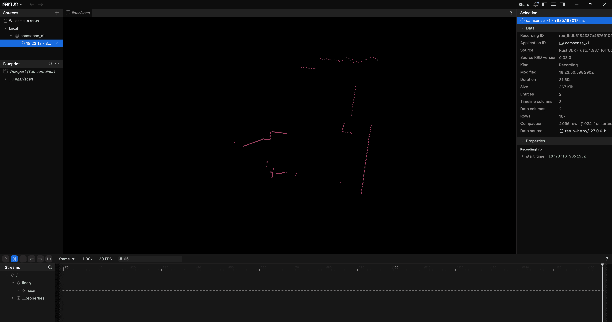

# Camsense-X1 - Linux Example

<figure style="align-items: center; text-align: center;">
    
    <figcaption>Screenshot of rerun viewer showing captured data from Camsense-X1</figcaption>
</figure>

## Quick Start

- Add user to `dialout` group in order to be able to access serial port:

  ```shell
  sudo usermod -a -G dialout $USER
  ```
  
  You have to logout and login again for the change to take effect.

- Install [Rerun](https://rerun.io/) viewer:

  ```shell
  cargo binstall rerun-cli@0.33.0
  ```

- Build and run binary:

  ```shell
  cargo run --release
  ```

  This may take some time to build...

  Once it's finished and if everything works,
  it will open the rerun viewer and show the LiDAR scans in real-time.
