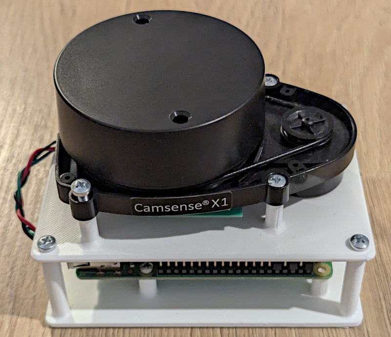

# Camsense-X1 - Raspberry Pi Example

## Quick Start

- Install [cross](https://github.com/cross-rs/cross)

- Build binary:

  ```shell
  cross build --release
  ```

- Copy code over ssh to raspberry pi and run it:

  ```shell
  bash scripts/copy_to_rpi_and_run.sh target/aarch64-unknown-linux-gnu/release/raspberrypi
  ```

## Case

To make it easier to assemble the system, I designed a simple case for
the Raspberry Pi and the Camsense-X1.

<figure style="align-items: center; text-align: center;">
    
    <figcaption>Picture of Raspberry Pi and Camsense-X1 case</figcaption>
</figure>

